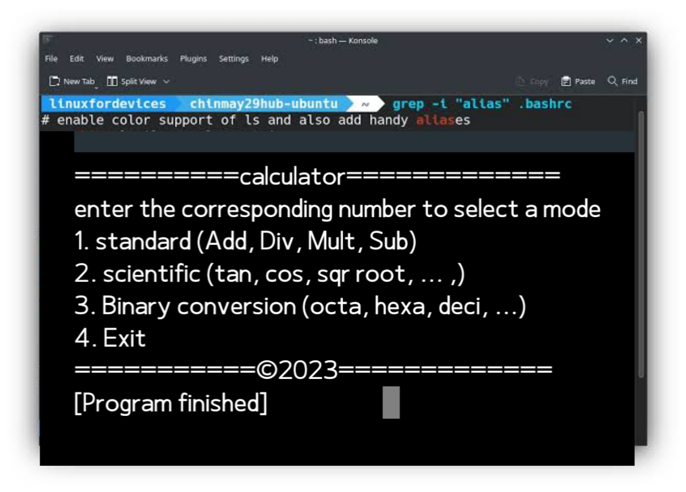

# SCR 
Scientific Calculator Remastered 

### Features

-  Three (3) calculator  modes
 1. STANDARD (addition, subtraction, multiplication, division)
 2. SCIENTIFIC (tan, cos, square root, ...)
 3. BINARY CONVERSION (octa, deci, hexa, ...)

- Code base in C
- To ensure the program works properly, compile all necessary files in this repository together before running the code. Preferably, compile it using GCC into an SCR.exe format for Windows or a compatible format for your operating system (Linux, Unix, Mac).
- want to understand how the program works? read the [official Documentation](Documentation.txt)

### DEVELOPERS

- [**Emmyliano**](https://github.com/emmyliano)
- [**CPU Governor**](https://github.com/CPU-governor)

### CONTRIBUTIONS & SUPPORT
- If you like our work then don't forget to give a Star :)
- feel free to contribute by creating issues (bug report), also feel free to leave a pull request

